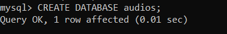
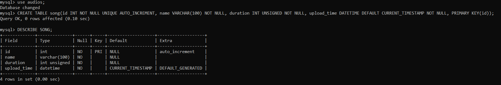
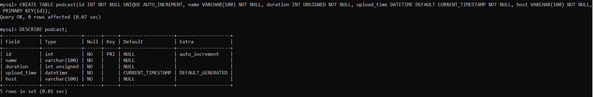
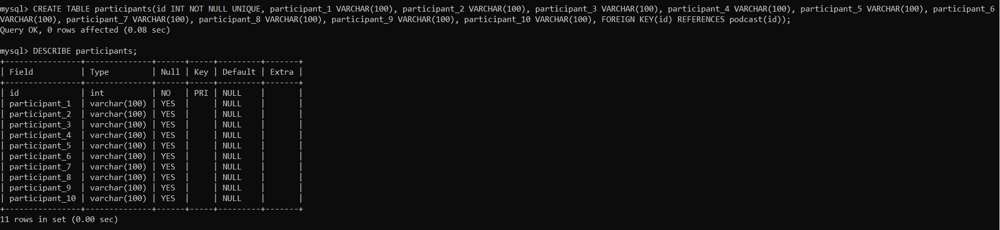
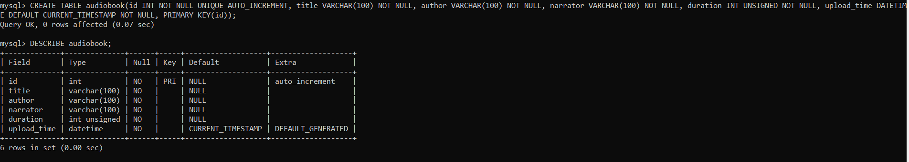
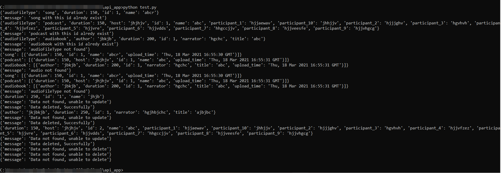
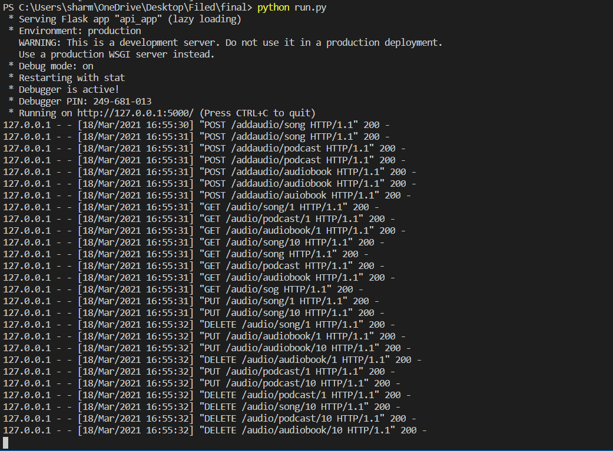

# Api-App

# Database
## audios

# Tables
Seperate table are created to store diffrent types of file
## Table 1 : song
This is to store song, it has four coulumns **id**, **name** - name of the song, **duration** - duration in number of seconds and **upload_time** - upload time of file

## Table 2 : podcast
This is to store podcast, it has five coulumns **id**, **name** - name of the podcast, **duration** - duration in number of seconds, **upload_time** - upload time of file and **host**

## Table 3 : participants
This is to store participants of podcast, this has eleven columns where **id** column is a `FOREIGN KEY` which `REFERENCES` to **id** column of **podcast** and other ten columns are **participant_1**, **participant_2**,----------,**participant_10** as a podcast can have only 10 participant at max

## Table 4 : audiobook
This is to store audiobook, it has six coulumns **id**, **title** - title of the audiobook, **author** - author of the title, **narrator** and **upload_time** - upload time of the file

# Output of test

# Responses of API

# Directions to use
After Download open a command prompt and navigate to location of **run.py** and type 'python run.py' this will start the app on localhost, now open another terminal and navigate to **test.py** file in **api_app** folder and type 'python test.py' than you will see a screen as shown image shown in **Output of test** with json responses to requests made by test file, and status responses to those request will be shown in command prompt which is running **run.py** similar to image shown in **Response of API**

# Requirements
**flask** - `pip install flask` \
**MySOLdb** - `pip install flask-mysqldb`
